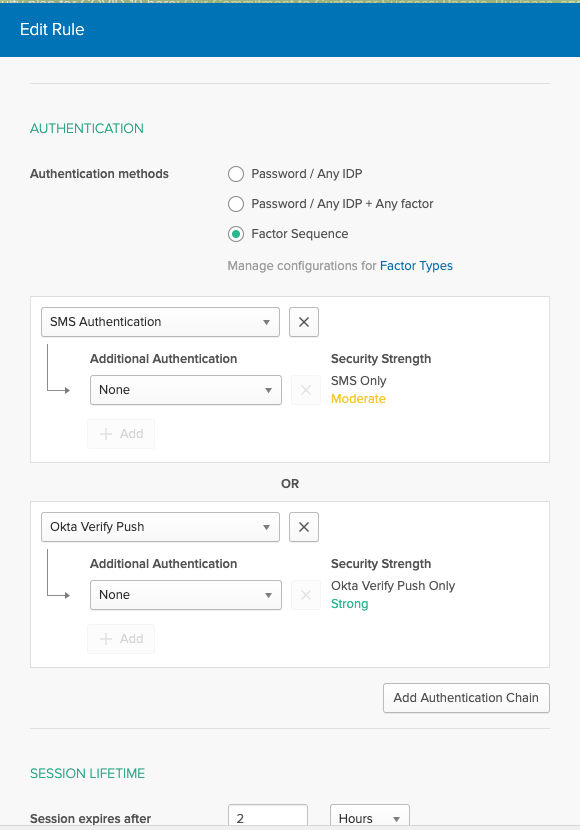
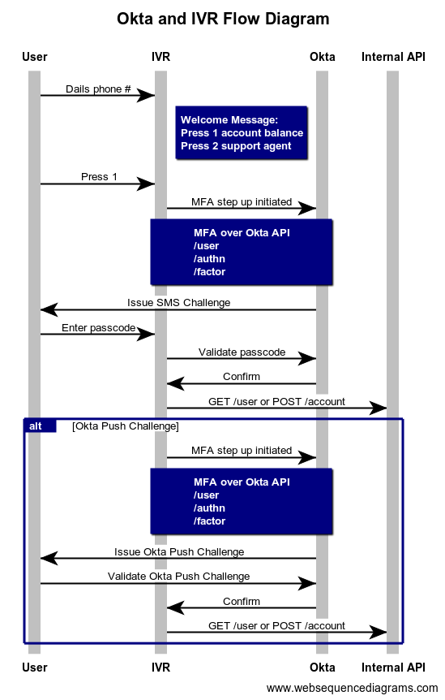

# Okta-Twilio-IVR/VoiceBot Demo <!-- omit in toc -->

Okta and Twilio integration IVR (Interactive Voice Response)/VoiceBot demo. This intergartion uses Okta for MFA on IVR/VoiceBot system (Twilio).

***Scenario:***

Jon needs to validate his identity against a VoiceBot. We able to validate Jon via pre-enrolled factor either SMS and Okta Verify Push, to then all Jon to navigate his acccount via the VoiceBot.

## Table of Content <!-- omit in toc -->
- [Pre-requirements](#pre-requirements)
- [Demo Setup](#demo-setup)
  - [Setup Twilio Tenant](#setup-twilio-tenant)
  - [Setup Okta Tenant](#setup-okta-tenant)
  - [Setup IVR System](#setup-ivr-system)
  - [Ngork side](#ngork-side)
  - [Flask side](#flask-side)
- [Usage Guide](#usage-guide)
- [Design](#design)
- [Authors](#authors)
- [Inspiration](#inspiration)

## Pre-requirements

- Python 3.8 and packages in [requirements](./requirements) files.
- ngrok (Local testing). [Manual instructions](https://ngrok.com/download) or "`brew install ngrok`." :tada:
- Twilio account
- Okta account
- Mobile phone with Okta Verify installed

## Demo Setup

> WARNING: You have to purchase a Twilio phone number for this demo function.

### Setup Twilio Tenant

> NOTE: This project piggybacks on existing walk-through from Twilio tutorial for Python/Flask + Twilio. My addition is using Okta MFA functionality into the mix. :smiley:

1. Follow the instructions Twilio guide purchase and create Phone number [here](https://www.twilio.com/docs/voice/quickstart/python#sign-up-for-twilio-and-get-a-phone-number). (OPTIONAL) You can follow the rest of the guide to get more familiar with Twilio + Python, but this guide is really about Twilio + Okta. :smiley:
2. The [Allow Twilio to talk to your Flask application](https://www.twilio.com/docs/voice/quickstart/python#allow-twilio-to-talk-to-your-flask-application) section is what we will focus on for this demo. It's gear toward Twilio Flask sample code, which I have extended to showcase Okta as MFA on IVR with couple of updates to Python and associated libraries. :blush:

### Setup Okta Tenant

> SMS, as MFA is not activated on `*.oktapreview.com` tenants. Please contact Okta support if you plan to use a `*.oktapreview.com` tenant for this demo. Reference Feature Flag: `SMS_SERVICE`
> Factor Sequence, is not activated on `*.oktapreview.com` tenants. Please contact Okta support if you plan to use a `*.oktapreview.com` tenant for this demo. Reference Feature Flag: `PASSWORDLESS_AUTHN_SIGNON_POLICY`

1. Create a free developer account at [developer.okta.com](https://developer.okta.com/).
2. To keep things somewhat organized we going to create the following resources in Okta
   - Custom Profile Attribute: ivrPhone, ivrFactorPreference
   - User: Jane Ivr
   - Group: Autobot-IVR
   - SignOn Policy & Rule: IVR Policy and IVR Rule
   - Multi-Factor Type enable and enrollment: SMS and Okta Very Push enabled and Factor Sequencing

> NOTE: Must be logged in as Admin to Okta org for the majority of the steps below.

Create two custom profile attributes: `ivrFactorPreference` and `ivrPhone`

1. On the top navigation bar, navigate to `Directory` > `Profile Editor`.
2. Select `Okta` on the filter section and click on the `Profile` button to open the Profile Editor screen.
3. Click on  `Add Attribute` button and enter the following fields for `ivrFactorPreference`:

| Name | Value |
| ---  | --- |
| Data Type | string |
| Display name | `IVR Factor Preference` |
| Variable | `ivrFactorPreference` |
| Description | `IVR Factor Preference` |
| Enum | Checked |
| Attribute members | Enter following pair of Display Name and Value (using `+ Add Another`)|
| 1. SMS | `SMS` and `sms` |
| 2. Okta Verify with Push | `Okta Verify with Push` and `push` |

4. Click `Save and Add Another` button and enter the following fields for `ivrPhone`:

| Name | Value |
| ---  | --- |
| Data Type | string |
| Display name | `IVR Phone Number` |
| Variable | `ivrPhone` |
| Description | `IVR Phone Number` |
| *NOTE* | Keep default value |

5. Click `Save` button.

Create a test user

1. On top navigation bar, navigate to `Directory` > `People`.
2. Click on `Add Person`.
3. Fill out the following fields

| Name | Value |
| ---  | --- |
| First Name | `Jane` |
| Last Name | `Ivr` |
| Username | `jane.ivr@mailinator.com` |
| Primary Email | `jane.ivr@mailinator.com` |
| Password | Set by Admin, give our user a password |
| User must change the password on first login | Un-check |

4. Click `Save`.
5. Search `Jane Ivr` and select her account.
6. In Jane Ive account view, select `Profile` tab and click on `Edit` button.
7. Locate the new custom attributes we create. You keep `IVE Factor Preference` to SMS but update the `IVR Phone` number with a real phone number for your demo. e.g `+17735551234`. *NOTE*: This is the phone number that Twilio will interact with.

Create a group

1. On the top navigation bar, navigate to `Directory` > `Group`.
2. Click `Add Group` and fill out the following fields.

| Name | Value |
| ---  | --- |
| Name | `Autobot IVR` |
| Group Description | Users assigned to Autobot IVR services |

3. Click `Add Group`.
4. Select `Autobot IVR` and `Manage People` button and add `Jane Ivr` to the group.


Create and enable Multi-factor SMS and Okta Verify Push and enrollment

1. On the top navigation bar, navigate to `Security` > `Multifactor`.
2. Under the `Factor Type` tab, enable `Okta Verify` by selecting the `Active` dropdown button and then clicking the `Edit` button and checking on `Enable Push Notification`.
3. Under the `Factor Type` tab, enable `SMS Authentication` by selecting the `Active` dropdown button.
4. Under the `Factor Enrollment` tab, click `Add Multifactor Policy` button.
5. Fill out the following fields:

| Name | Value |
| ---  | --- |
| Policy Name | `Autobot IVR Factor Policy` |
| Policy Description | `Autobot IVR Factor Policy` |
| Assign to Groups | `Autobot IVR` |
| Effective factors | |
| 1. Okta Verify | Required |
| 2. SMS Authentication | Required |

6. Click `Create Policy` and fill out the following fields:

| Name | Value |
| ---  | --- |
| Rule Name | `Incoming calls to Autobot IVR` |
| AND User is accessing | Okta is checked |

7. Click `Add Rule`.

Create SignOn Policy and Rule

1. On top navigation bar, navigate to `Security` > `Authentication`.
2. Navigate to `Sign On` tab and click on `Add New Okta Sign-on Policy`.
3. Fill out the following fields:

| Name | Value |
| ---  | --- |
| Policy Name | Autobot IVR |
| Policy Description | Autobot IVR Policy |
| Assign to Groups | Autobot IVR |

4. Click `Create Policy and Add Rule`.
5. Fill out the following fields in the `Edit Rule` screen:

| Name | Value |
| ---  | --- |
| Rule Name | `Autobot IVR Rule` |
| AUTHENTICATION SECTION |  |
| Authentication method | Factor Sequence is selected |
| Add two factor sequence types | 1. SMS Authentication |
|                        | 2. Okta Verify Push |
|                        | 3. Password |

6. Click `Create Rule`.

e.g.



### Setup IVR System

Quick start

> Running locally requires the use of ngork. ngork will act as a proxy to expose our running instance to the internet, which allows Twilio to reach our endpoints that we implemented. Of course, you could host this yourself on Heroku or other similar Python hosting providers.
> :warning: NOTE: Running this demo requires two active sessions: ngork and flask. :warning:

### Ngork side

1. Start ngork using makefile or `ngrok http 5000 -host-header="localhost:5000"`.

```bash
make ngrok
...
# example output
ngrok by @inconshreveable                                                                  (Ctrl+C to quit)

Session Status                online
Account                       Noi Narisak (Plan: Free)
Version                       2.3.35
Region                        United States (us)
Web Interface                 http://127.0.0.1:4040
Forwarding                    http://d03eb3d2e662.ngrok.io -> http://localhost:5000
Forwarding                    https://d03eb3d2e662.ngrok.io -> http://localhost:5000

Connections                   ttl     opn     rt1     rt5     p50     p90
                              4       0       0.00    0.00    1.17    10.27
```

1. Copy the `Forwarding` URL address because you need this to update your Twilio webhooks. (eg. `https://d03eb3d2e662.ngrok.io`)
2. The following steps to [Configure your webhook URL](https://www.twilio.com/docs/voice/quickstart/python#configure-your-webhook-url) section has the details. :exclamation:Twilio direct URL anchor may not work, just search (CTRL-F) for "Configure your webhook URL".

### Flask side

```bash
git clone git@github.com:noinarisak/okta-twilio-ivr.git
cd okta-twilio-ivr

# copy and update the `.env.sample` to `.env`
cp .env.sample .env

cat .env
## output
OKTA_ORG_URL=https://dev-xxxxxx.okta.com
OKTA_API_TOKEN=00h5GB...

APP_CUSTOMER_NAME="ACME INC MOBILE"%
...

# Run!!!
make run
```

## Usage Guide

Test user needs to enroll both factors for MFA: `SMS` and `Okta Verify Push`.

1. Enroll the user by logging in as Jane Ivr.
2. Navigate to Jane's name and in the dropdown button, select `Setting`.
3. In the extra `Verification` section, proceed to setup both SMS and Okta Verify Push.

Walk through instructions with interacting with the IVR.

1. Dial the number that you have registered with Twilio. (ie. `1-207-555-1234`)
2. Walk through the voice instructions and execute MFA (eg. Either `SMS` or `Okta Verify Push`)
3. Switch over to another factor by logging in as Super admin to your Okta org and updating "Jane Ivr" profile. Switching her `ivrFactorPreference` to another factor.
4. And finally, Thanks! :tada:

## Design

Sequence Diagram Flow



## Authors

- [noinarisak](https://github.com/noinarisak) Me :tada:

## Inspiration

- [Twilio IVR Example](https://github.com/TwilioDevEd/ivr-phone-tree-python)
- [Article by Indranil Jha](https://sec.okta.com/articles/2020/06/adaptive-step-multi-factor-authentication) - [Indranil Jha](https://github.com/indranilokg)
